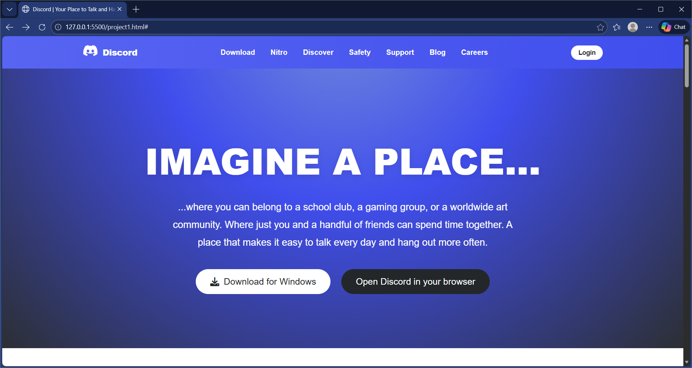

# Discord Homepage Clone

A fully responsive, pixel-perfect recreation of the Discord homepage. This project demonstrates modern HTML5 and CSS3 techniques, including Flexbox layouts, complex gradients, and keyframe animations.



## 🚀 Live Demo
[View Live Demo](https://your-username.github.io/your-repo-name)

## ✨ Features

* **Responsive Design:** Fully fluid layout that adapts to mobile, tablet, and desktop screens.
* **Modern CSS Styling:** Uses CSS Variables (`:root`) for consistent theming.
* **Advanced Animations:**
    * Fade-in entrance animations for hero text.
    * Hover effects with transitions and transforms on buttons.
    * Floating elements and smooth navigational underlines.
* **Rich Media:** Integrated autoplaying video backgrounds (muted & loop) for feature sections.
* **Discord Branding:** Authentic "Blurple" color palette, specific font stacks, and SVG logos.

## 🛠️ Tech Stack

* **HTML5:** Semantic structure (`<header>`, `<main>`, `<section>`).
* **CSS3:** Flexbox, Grid, CSS Variables, Keyframes, Media Queries.
* **Assets:** Font Awesome (icons), Discord CDN (videos).

## 📂 Project Structure

```text
├── index.html      # Main HTML structure
├── style.css       # All styling, animations, and responsive rules
├── preview.jpg     # Screenshot for this README
└── README.md       # Project documentation
